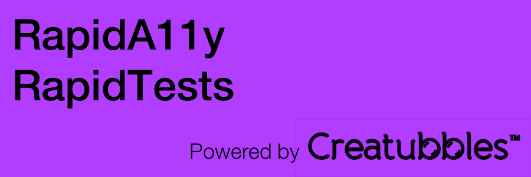

[](https://cocoapods.org/pods/RapidTests)
[](https://github.com/creatubbles/Rapid/blob/master/LICENSE.md)
[](https://cocoapods.org/pods/RapidTests)

## FAQ

#### What is the control's index represent? We have to keep track of an array of indices?  Looks like it could easily break if the order of views changes?

A Rapid control's index represents it's position in the hierarchy traversal that the accessibility engine makes all the time. By defining our controls in this indexed way, we match to the accessibility engine's indexing defaults, meaning tests **SHOULD** break if the *order of views changes*. The standard accessibility engine just grabs the view hierarchy as the tree that it is and does a systematic traversal through it. This indexing just mimics the accessibility engine in that it just goes `top-left` corner to `bottom-right` corner, left to right then top to bottom as a "traversal algorithm". What this means is if you have 4 views stacked on top of each other, the accessibility engine's recognition of those views will reliably be indexable by their position. Rapid simply "hops on" to this reliability, placing indexing maps inside the app code for us to access in test code (the `rapidControlsInformation` arrays are these maps). This way, in our test code we can easily match up any arbitrary UI the accessibility engine tells us we have (IE 5 views, in a specific indexed order) with something we expect (IE the map from `rapidControlsInformation()`).


Therefore, if the view changes, the UI tests MUST change to adapt. Since this strict order will be out of sync, the test will fail, and Xcode will be prompt you to fix, automatically. This is intentional :smiley:

#### What does the `rapidControlsInformation()` return value represent? What is the `Array<RapidControlInformation>` describing? 

This method defines the "static definition" of this screen. There are 2 definitions of each screen, one static and one not. The non static version is the array of actual controls (for example [usernameTextField, passwordTextfield, loginButton, signUpButton] in a signin landing page). The static version holds the types of controls and their order, so the testing system can grab this generically when it wants to find specific controls on screen. This static version of the previous example for signup would be (as defined by the `rapidControlsInformation()` protocol method): 

```
    static func rapidControlsInformation() -> Array<RapidControlInformation> {
	    var textFieldProperties = UITextField.accessibilityProperties
		var buttonProperties = UIButton.accessibilityProperties
		var usernameProperties = textFieldProperties
		textFieldProperties.index = 1
		var passwordProperties = textFieldProperties
		buttonProperties.index = 2
		var loginProperties = buttonProperties
		buttonProperties.index = 3
		var signUpProperties = buttonProperties
		return [usernameProperties, passwordProperties, loginProperties, signupProperties]
	}

```

As you can see the indexing here simply follows the visual approach described above. The `accessibilityProperties` variable is automatically defined on all `NSObject`s when RapidA11y is imported, and the only thing to define is each control's index property (it's position in the array, and by continuation also it's position in the UI for the accessibility engine to read through the controls).